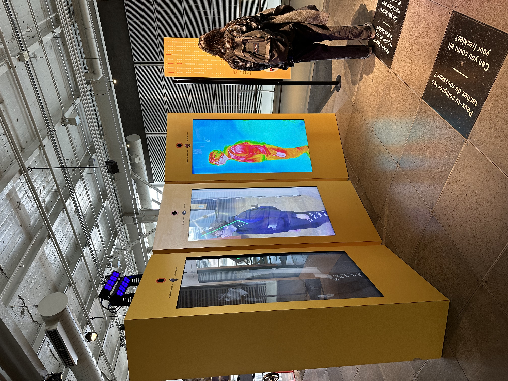
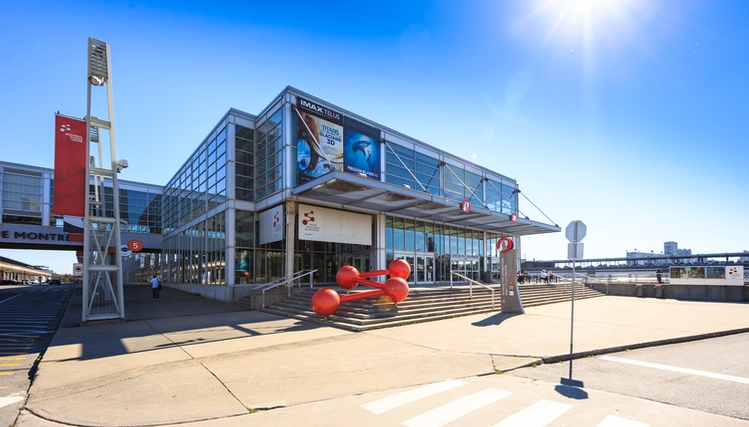
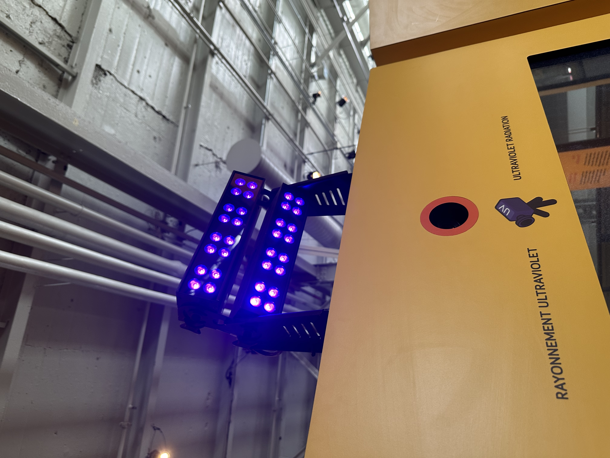
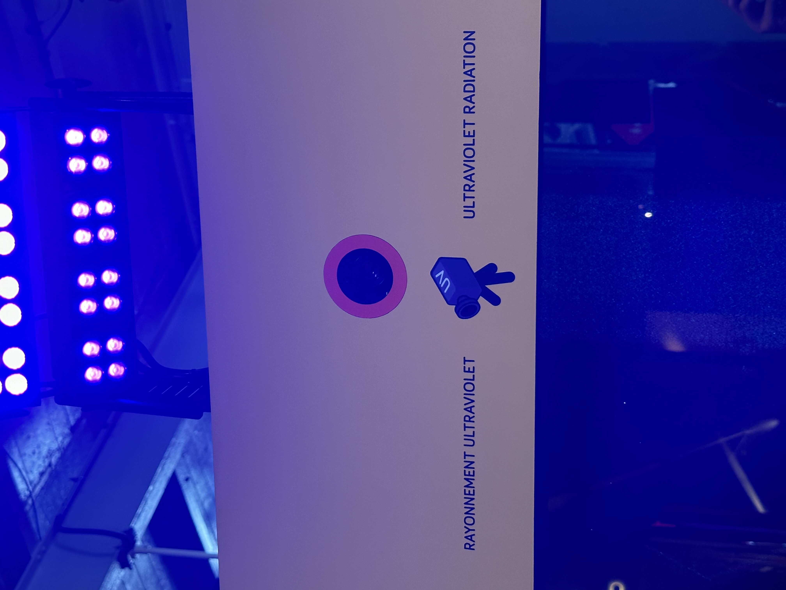
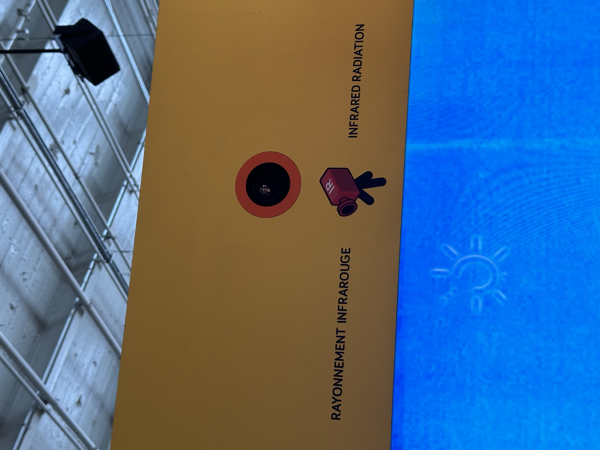
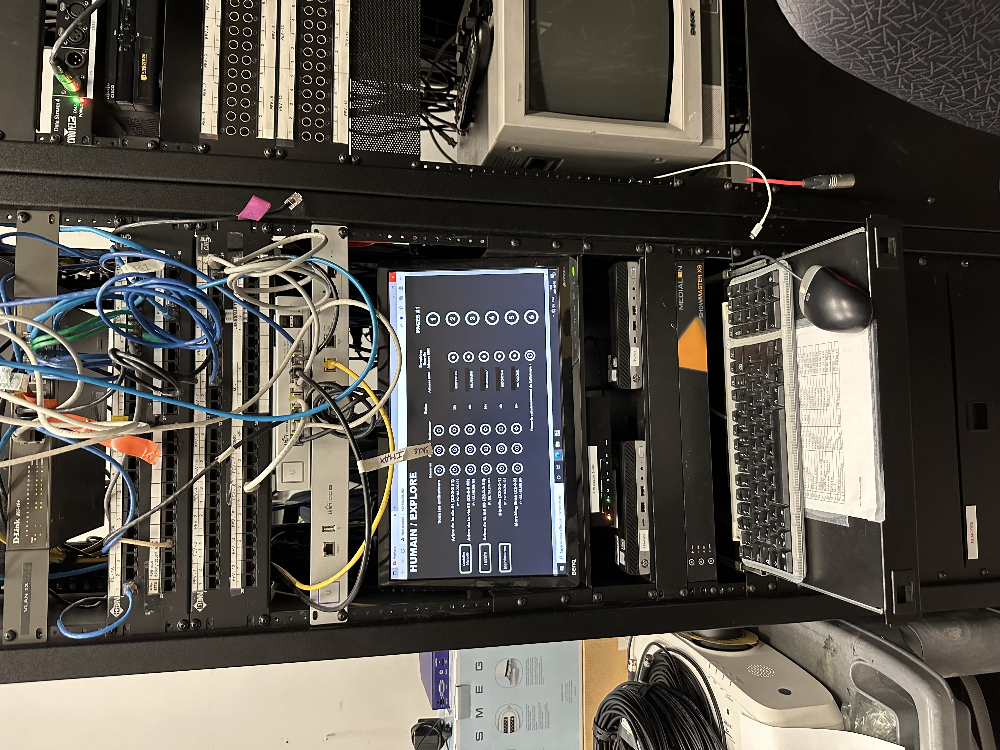

# Centre des sciences : voir l'invisible

# titre du dispositif : Voir l'invisble

vue d'ensemble

## Lieu de mise en exposition: Centre des sciences
 2 R. de la Commune O, Montréal, QC H2Y 4B2

## type d'exposition : intérieur

## Date de la visite
10 avril 2024

## Année de réalisation
En 2000 mais l'oeuvre à changé de nom en 2002

## Description du dispositif

## Type d'installation: Interactif
Pour déclencher le dispositif, tu dois te positionner devant l'une des différentes caméras, ce qui permettra d'afficher ton image dans un état différent.

-Premier écran noir et blanc

-Deuxième écran miroir

-Troisième écran infrarouge

# Mise en espace

Le dispositif se trouve, comme il a été montré dans l'installation, dans l'une des pièces du centre de Montréal, et les trois dispositifs sont fixés au sol.

## Fonction du dispositif

## Composantes et techniques

### Le dispositif est équipé d'une caméra UV, ce qui signifie une caméra ultraviolette conçue pour capturer des images dans la gamme de longueurs d'onde des ultraviolets. Contrairement aux caméras visibles qui enregistrent la lumière visible par l'œil humain, les caméras UV sont sensibles aux rayonnements ultraviolets émis par des sources telles que le soleil, certaines lampes fluorescentes, et divers objets et matériaux. Elles sont équipées de filtres spéciaux pour bloquer la lumière visible et ne capturer que les rayonnements UV. Ainsi, le projecteur diffuse la lumière UV tandis que la caméra capte l'UV pour nous afficher en noir et blanc sur l'écran du dispositif.

### Les caméras infrarouges utilisent des capteurs sensibles aux infrarouges pour convertir les variations de température en images thermiques. 

### Contrôle des lumières

## Expérience vécue
J'ai beaucoup apprécié cette exposition car elle m'a offert une perspective totalement différente sur le monde qui m'entoure. La caméra infrarouge est celle qui m'a le plus surpris, car elle nous permettait de visualiser le climat de notre corps, ce qui m'a profondément étonné. Savoir qu'il était possible de percevoir le climat corporel non seulement de l'intérieur, mais aussi de l'extérieur, a été une expérience fascinante. Ces expériences m'ont montré à quel point les filtres de caméra peuvent être des outils puissants pour améliorer la créativité et la qualité de nos photographies, tout en nous permettant d'explorer et de découvrir le monde qui nous entoure sous un nouvel angle. aurais beaucoup aimé découvrir plus de filtres pour ce dispositif. Il y a quand même très peu de contenu pour un appareil avec autant de potentiel.
