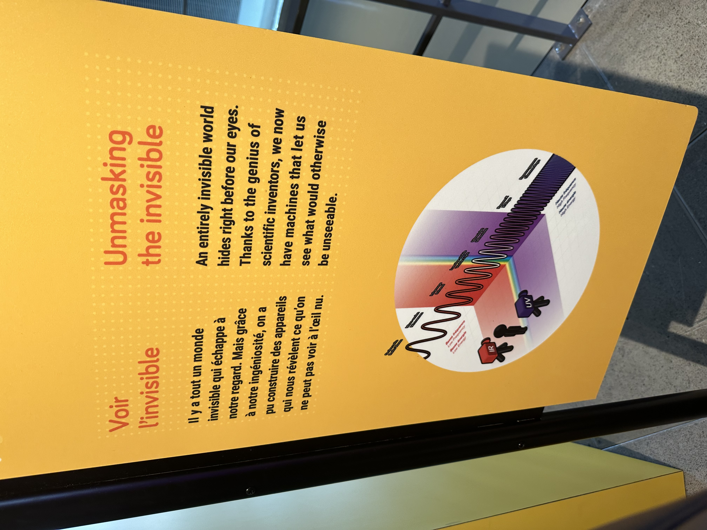

# Centre des sciences : voir l'invisible

# titre de l'oeuvre
Voir l'invisble

## Lieu de mise en exposition
 2 R. de la Commune O, Montréal, QC H2Y 4B2

## type d'exposition : intérieur

## Date de la visite
10 avril 2024

## Année de réalisation
En 2000 mais l'oeuvre à changé de nom en 2002

## Description de l'oeuvre

## Type d'installation: interactive

## Fonction du dispositif

## Mise en espace

tml

## Composantes et techniques

## Expérience vécue

