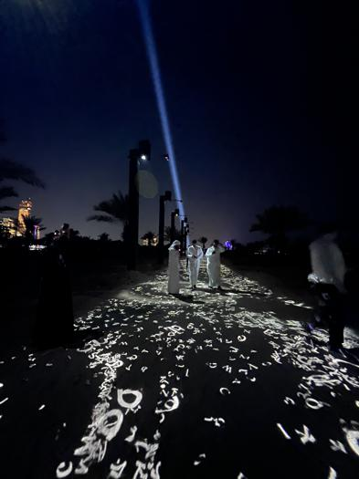

# Rafael Lozano-Hemmer

## introduction
L'intervenante, Jade Séguela, est une registraire chargée de gérer l'intégralité des données qui lui sont confiées. Son rôle consiste à planifier la gestion des installations des expositions, superviser le transport et l'assurance des œuvres, ainsi que la documentation et l'enregistrement des objets exposés. Elle veille à ce que toutes les expositions se déroulent de manière professionnelle et sécurisée. Elle nous a parlé de l'exposition que son équipe devait réaliser pour Rafael Lozano-Hemmer et nous a raconté à quel point il faut être organiser pour réaliser la production d’un artiste.

## développement
Rafael Lozano-Hemmer est un artiste numérique canadien-mexicain reconnu pour ses installations interactives explorant la technologie. Né en 1967, il a étudié la chimie-physique à l'Université Concordia de Montréal avant de se tourner vers les arts électroniques. Ses œuvres sont largement activées par des caméras, des capteurs ou des microphones, captant ainsi l'activité du public. Pour lui, l'art ne peut exister sans public, car que serait l'art s'il n'y avait rien à montrer ? Une équipe dirigée par Rafael avait pour mission de réaliser une exposition pour le Roi d'Abu Dhabi, dans un environnement désertique, avec pour objectif de le rendre touristique. Les conditions de travail étaient extrêmement difficiles, avec du sable envahissant les appareils et une chaleur intense, rendant le travail insupportable. De plus, Jade nous a montré un oiseau ayant construit un nid au-dessus de leurs installations, ce qui soulignait les difficultés rencontrées. Le fait d'installer une exposition dans un endroit désertique était particulièrement compliqué, car il n'y avait ni prise ni autre technologie pour faciliter l'installation. Ils devaient fournir leurs propres câbles pour que tout fonctionne. L'exposition visait à créer un chemin avec des lettres en écriture arabe, devenant interactif lorsque les visiteurs marchaient dessus, les lettres s'affichant alors en anglais lorsque l'appareil détectait leurs mouvements. Rafael s'est assuré à ce que tous les câbles et composants de l'exposition soient noirs, afin que l'attention du visiteur se concentre sur l'exposition elle-même et non sur autre chose. Cette interactivité passive permettait à l'œuvre de prendre vie.

 
## conclusion
Pour conclure, j'ai trouvé vraiment impressionnant l'épreuve que l'équipe a dû surmonter, même si c'était l'une des expositions les plus simples qu'ils avaient à faire. Cependant, les conditions de travail particulières, notamment le fait qu'elle se déroulait dans un endroit désertique, ont quelque peu perturbé leur travail. Leur persévérance m'a tellement inspiré que  j'aimerais rechercher un environnement de travail où mes collègues partagent la même passion et la même détermination que l'équipe qui a réalisé le translation stream. 

