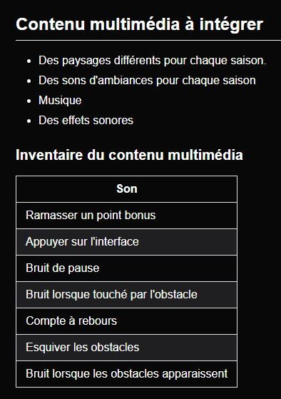
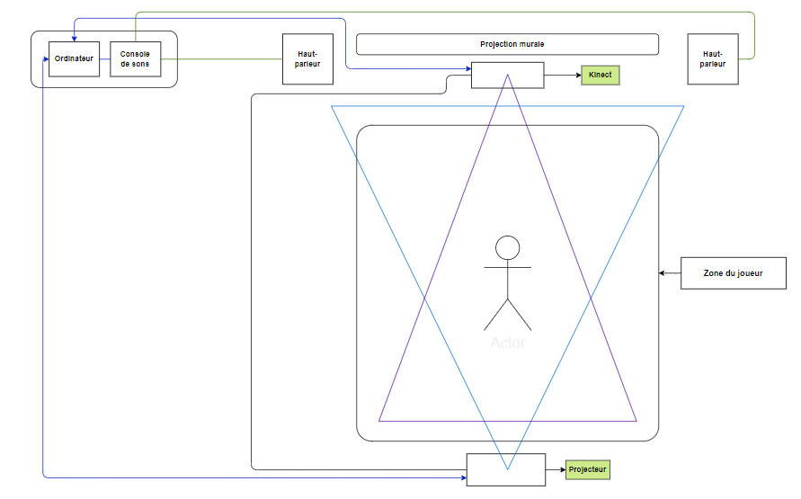
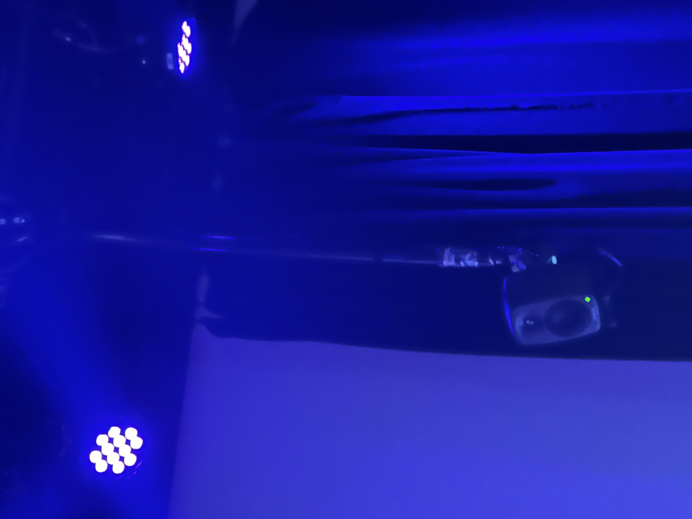
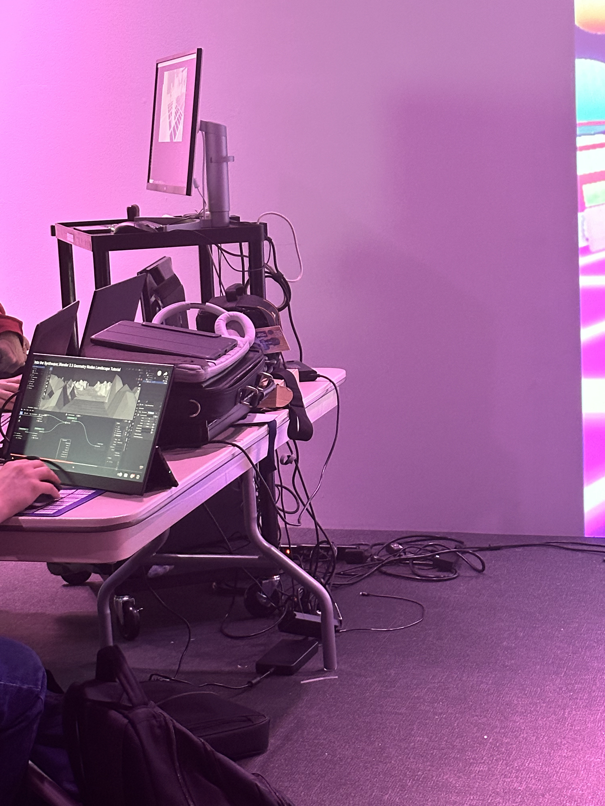
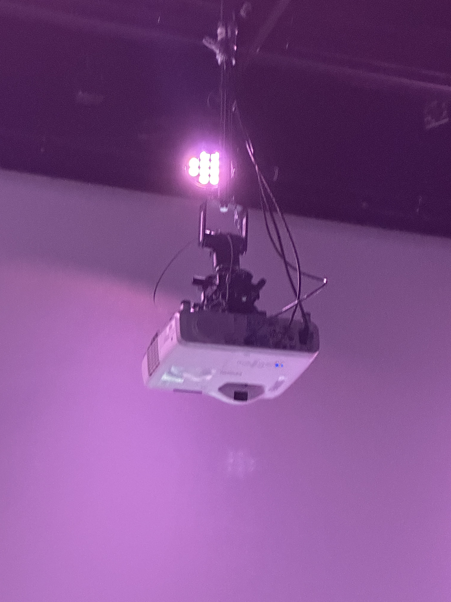
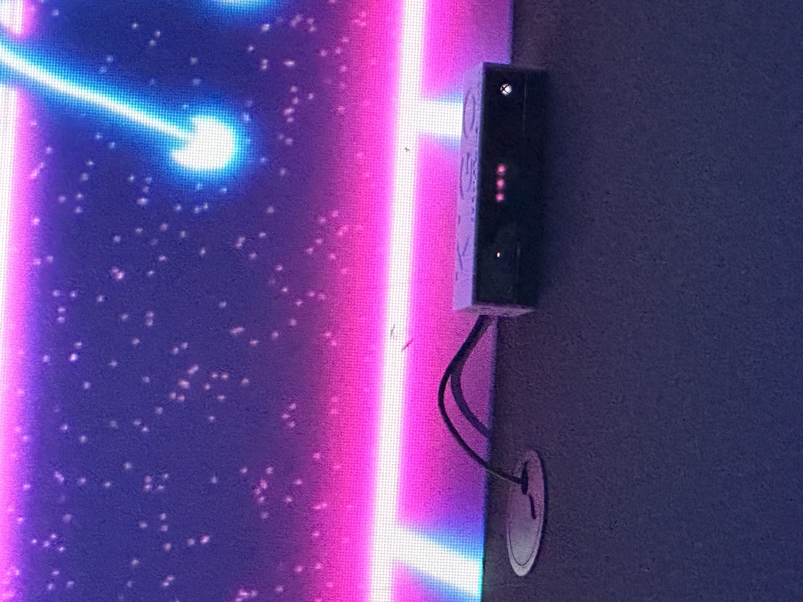

# Kigo

## Créateurs
Érick Ouellette

William Rathier Mailly

Gabriel Clerval

Nicolas St-Martin

Antoine Dion

## En quoi Kigo est en lien avec Crescentia?
le fait que leur projet est en rapport avec une toile interactive, il pourrait avoir un lien avec Crescentia du fait que la plateforme créative est en constante évolution se qui pour être associé à la croissance puisque Crescentia est une plante ayant pour but de grandir pour ainsi avoir la forme parfaite. et donc on chercherait sur la plateforme une forme qui pourrait nous satisfaire.

## Installation en cours

## Lieu de mise en exposition
Le grand studio de l'école Montmorency

## type d'exposition : intérieur

## Date de la visite

## Année de réalisation
2023

## Description de l'oeuvre
Kigo est un projet multimédia interactif où l’interacteur doit esquiver des obstacles virtuels qui se rapproche vers lui dans une thématique des quatre saisons de l’année. L’interacteur doit embarquer se déplacer dans une zone de jeu où une Kinect captera ses mouvements. L’avatar du jeu suivra les mouvements de l’interacteur. Les mouvements possibles sont d’aller de gauche à droite et l’accroupissement. L’esthétique du projet sera une projection d’un univers 3d de style néon rétro, qui ressemblera à une route où les obstacles s’avancent vers le joueur. Il y aura des arbres des deux côtés de la route et ceux-ci vont changer à chaque niveau puisque ces niveaux sont basés chacun sur une saison différente. Une musique synthwave jouera pour chaque niveau et sera accompagnée d’ambiances et des bruitages semblables à leur saisons. Le temps de cette expérience est démontré par le fait que chaque niveau se passe dans une différente saison, ce qui fait passer une année. Cette expérience a pour but d’amener de faire ressentir à l’interacteur, de l’engagement et de la détermination pour finir ces niveaux qui deviennent de plus en plus difficiles.

https://tim-montmorency.com/2024/projets/Kigo/docs/web/preproduction.html

## Type d'installation: interactive

## Fonction du dispositif

source : https://tim-montmorency.com/2024/projets/Kigo/docs/web/preproduction.html

## Mise en espace
-projecteur 

-haut-parleur 

-bandage qui forme un carré (zone du joueur)

-Grand studio

source de l'image du plan: https://tim-montmorency.com/2024/projets/Kigo/docs/web/preproduction.html

## Composantes et techniques

#### 2 Haut-parleurs Genelc 8010APM pour entendre la musique et les bruits sonores de l'exposition

#### 2 Cordon IEC (pour alimenter les haut-parleurs)

#### 4 Câbles XLR (M->F) (Longueur minimale estimée entre 4-6 mètres)

#### 1 Câble d’alimentation pour ordinateur

#### 1 ordinateur (pour régler des paramètres de l'exposition)

#### 1 projecteur pour diffuser l'exposition (élément nécessaire à la mise en exposition)

#### Kinect V2 (capte les mouvement du visiteur pour interagir avec l'exposition)

## Expérience vécue
L'exposition Kigo est l'une de celles que j'ai le plus appréciées, car le fait qu'elle consiste en une interaction directe m'a permis de faire mon choix rapidement parmi toutes les expositions. En tant que personne qui aime bouger et interagir avec son environnement tout en l'analysant, cette approche m'a vraiment séduit. Kigo est véritablement un projet incroyable, très addictif car il pousse à chercher le meilleur score tout en évitant les obstacles le plus longtemps possible. Le thème de l'atmosphère est un choix judicieux, car il s'harmonise parfaitement avec celui de l'exposition, à la fois futuriste et rétro, qui captive par sa beauté visuelle et son ambiance immersive. J'aurais grandement apprécié que la Kinect puisse détecter les mouvements de deux personnes simultanément, ce qui aurait ajouté un défi supplémentaire en permettant non seulement de survivre, mais aussi de surpasser un adversaire dans le jeu.
