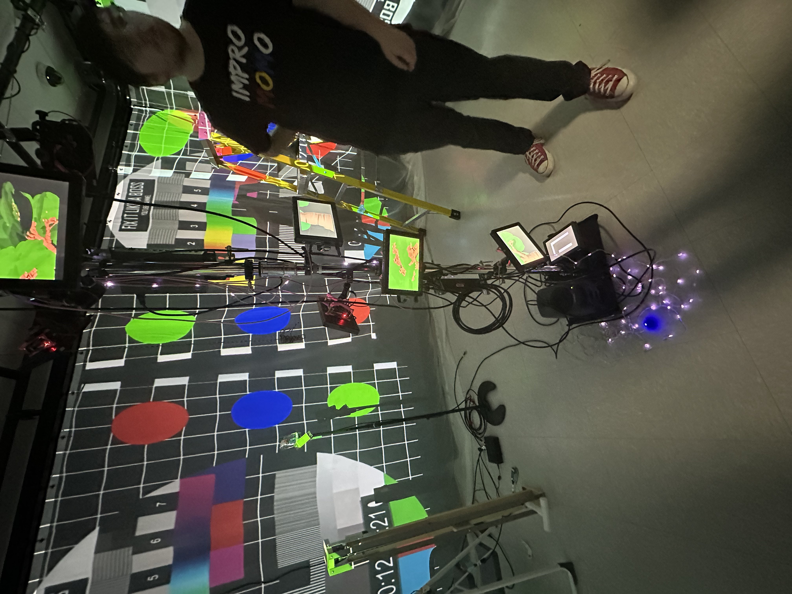
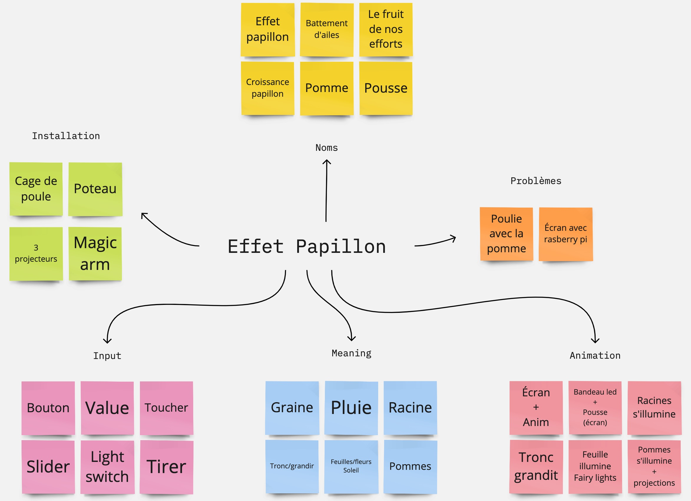
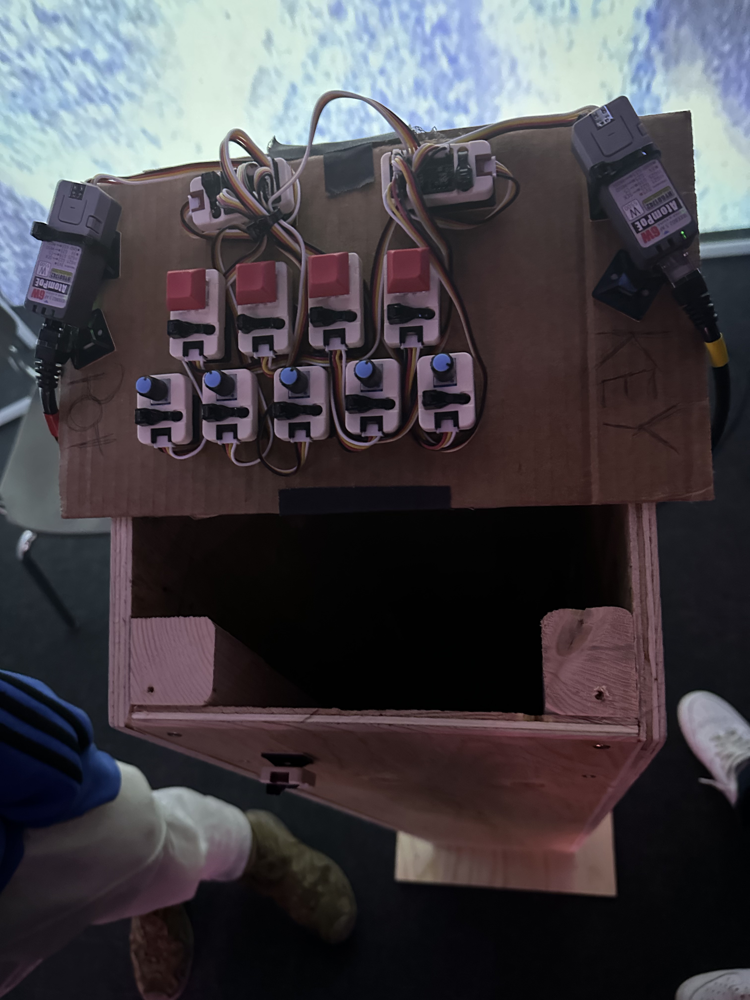
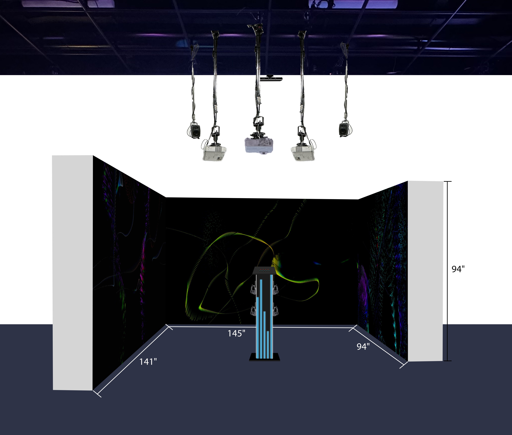
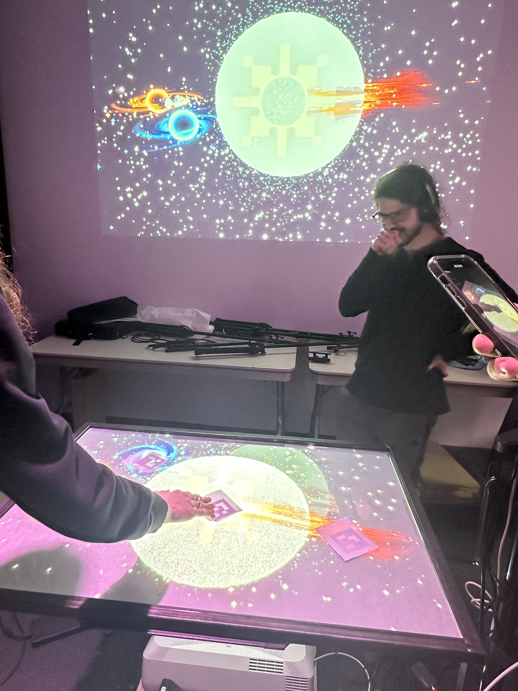
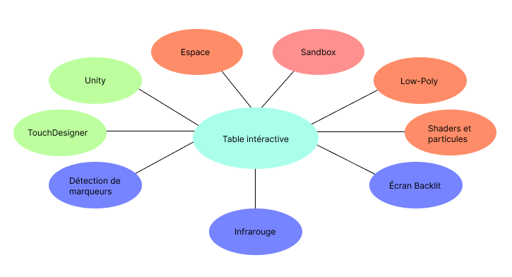

# Effet papillon, Sonalux, Canevas cosmique, Rhizomatique

# 1. Effet papillon
##Lien avec le thème Crescentia
Puisque  l'effet papillon est un écosystème artificiel, il aurait un lien fort avec Crescentia puisque le projet souligne beaucoup l'évolution un peu comme Crescentia, qui est un genre d'arbre qui accroit puisque c'est une plante. leur similute serait du fait que Crescentia souligne la croissance de la plante et l'effet papillon l'évolution d'un nouveau départ.

## l'installation en cours dans le studio

On peut voir que dans le studio il y'a des fils éparpillés un peu partout mais chacun de ses fils ont une tâche importantes pour le fonctionnement de l'exposition dans le studio. Le fond de la pièce n'a pas encore de fond pour nous faire sentir dans l'atmosphère de l'expostion comme on peut le voir. Donc on peut dire que ceci représente le squelette de l'exposition et qu'il reste encore des choses à faire avant qu'il soit complet.
### vue du processus de l'arbre
 

# le schéma de l'installation
Ici nous pouvons voir de la façcon que l'équipe s'est organisé pour l'installation de leur exposition' l'input qui est la façcon de déclencher se qui va se passer à l'exposition se va au meaning qui va nous permettre de comprendre qu'est ce que cela va déclencher aprèes à l'animation qui va nous montrer se que l'action qu'on a effectuer va interagir avec l'exposition.

# Appréciation
J'ai vraiment apprécié la complexité de cette exposition. Il y a tant de choses à dire. On peut la voir comme une sorte de jardin artificiel, et je trouve ça vraiment original comme concept. Le fait que le visiteur doit faire évoluer le cycle de la pomme sans instruction, mais en suivant son propre instinct, est un moyen intéressant de rendre l'exposition agréable. Le visuel était parfait, j'étais fasciné par l'atmosphère. Cette exposition sera vraiment une expérience mémorable.

# 2. Sonalux
## Lien avec le thème Crescentia

Le projet pourrait avoir un lien avec Crescentia du fait que le visiteur se voit projeté dans un voyage astral tout en contrôlant la projection de la zone à sa guise. Il pourrait également être lié à Crescentia en fonction de la quantité de graines, d'eau ou de l'arbre dont on dépend pour voir comment l'arbre va évoluer, un peu comme dans Sonalux où le visiteur essaie des choses pour voir comment son espace évolue.

## l'installation en cours dans le studio

Donc, on peut observer plusieurs interrupteurs, chacun ayant ses propres fonctions. On peut également remarquer que le podium où les visiteurs vont interagir avec les boutons pour changer la pièce est faite de bois afin d'être solide et de rester en place, suivie d'un carton pour permettre à l'interrupteur d'être en équilibre sur le podium.

## le schéma de l'installation

On peut voir sur le schéma que le podium est beaucoup plus moderne et qu'il contient des LED pour le rendre un peu plus interactif. On peut aussi constater qu'il ne contient que le podium pour que le visiteur vive l'expérience de l'exposition sans être distrait par autre chose. C'est entre le visiteur et l'exposition que tout se passe.

## Appréciation
L'exposition offre une expérience immersive unique où le visiteur devient le maître de son propre voyage. En pesant sur les boutons, j'ai pu vivre une expérience satisfaisante en transformant l'environnement qui m'entourait. Chaque essai offrait une nouvelle atmosphère, m'incitant à explorer davantage et à créer une zone qui pouvait me plaire. C'était vraiment sensationnel.

# 3. Canvas cosmique 
## Lien avec le thème Crescentia
Cette exposition pourrait avoir un lien avec Crescentia du fait que les phénomènes déclenchés avec les planèetes pourraient être des événements naturels tels que la croissance des plantes, le cycle des saisons ou des interactions entre les éléments de la nature. Cela créerait un lien fort du fait qu'on manipule les forces de la nature.
## l'installation en cours dans le studio

L'exposition "Canvas Cosmique" est équipée de deux projecteurs : l'un pour visualiser le déclenchement des phénomènes sur le mur, et le deuxième sur une table interactive pour obtenir un visuel de ce avec quoi l'on souhaite interagir, à l'aide de papiers munis de codes QR permettant de contrôler différentes planètes.

## le schéma de l'installation

## Appréciation

# 4. Rhizomatique
## Lien avec le thème Crescentia
Cette exposition pourrait avoir un lien avec Crescentia du fait que la toile est interprétée comme les racines d'un arbre et que les projecteurs pourraient représenter des éléments visuels de la nature.
## l'installation en cours dans le studio
## le schéma de l'installation
## Appréciation

# Analyse

Selon moi, il est logique que le cours qui me semble incontournable pour toutes les expositions soit le cours de domaines multimédias, car les participants doivent se familiariser avec un ordinateur, les périphériques et les réseaux afin de bien exploiter la technologie pour rendre leur projet réel. Pour l'exposition "Effet Papillon", il semble logique qu'ils aient besoin du cours d'audio pour créer les bruits sonores de l'environnement de leur projet qui est en rapport avec la nature, tels que les bruits d'oiseaux, de feuilles, le tonnerre, etc. De plus, le cours de Web a dû être important pour leur projet, notamment pour l'animation des racines et des transitions au niveau des racines qui poussent en croissance à mesure qu'on avance dans l'exposition. Pour "Sonalux", les cours d'animation ont été importants pour pouvoir créer les différentes lumières lorsqu'on appuie sur le bouton qui déclenche justement cette animation, ainsi que pour la modélisation 3D afin de créer les différents types de lumières. Pour "Canvas Cosmique", le cours d'audio a dû être important pour les bruits sonores des planètes qui interagissent entre elles, et la modélisation 3D pour créer les planètes. Enfin, pour "Rhizomatique", le cours d'audio a dû être important pour l'ambiance sonore afin de permettre au visiteur d'être immergé dans l'exposition, et une fois de plus, le cours d'animation a dû être important pour créer les particules.

