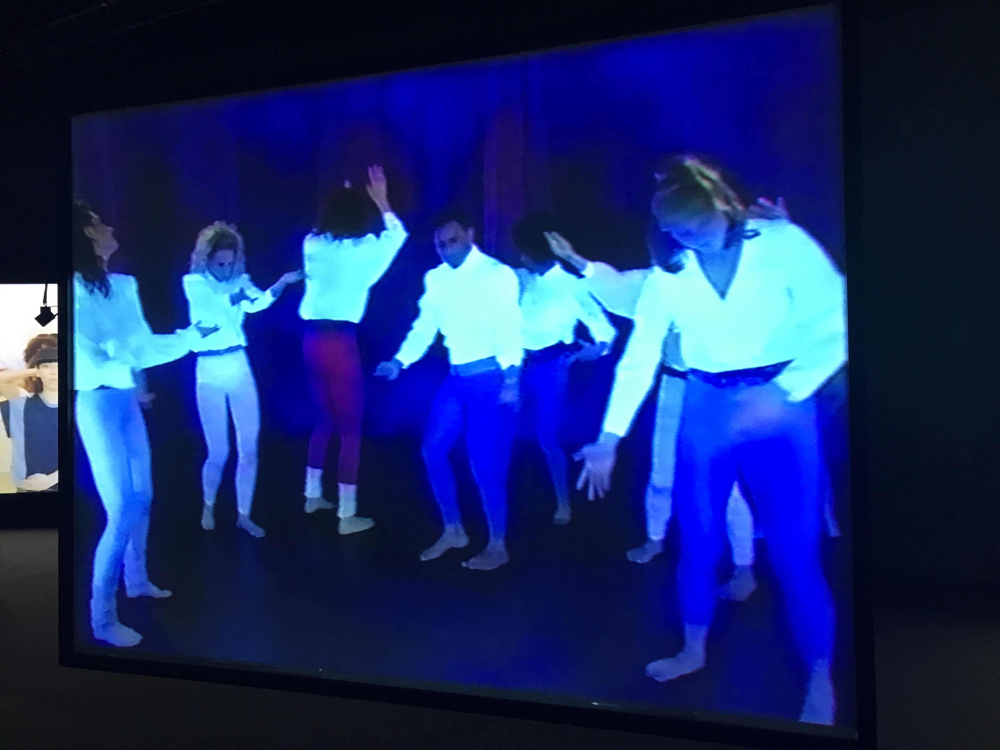

# Mon avis sur cette expérience

Je n'ai jamais vraiment assisté à une exposition de ma vie mais celle-ci m'a permis de découvrir un peu à quoi consiste une exposition, qui est un événement qui attise la curiosité du public et qui permet de montrer l'art d'une différente manière. Pour commencer, j'ai trouvé très agréable de profiter de cette exposition avec de très doux tapis car cela à permis de profiter de cette expérience confortablement que se soit, assis où coucher. Cet au choix du visiteur de déterminer  comment ils veut profité de cette activité. Cette exposition explore  différente pratique de la transcendance à travers les projecteurs suivi d'une bande sonore qui permet de rendre cette activité immersive. Les vidéos présentaient chacun une troupe qui dansait de manière un peu différente mais du même objectif qui est d'entrer sous l'état de la transcendance. Quelques minutes plus tard, la musique devenait de plus en plus intense jusqu'a se que les différents danseurs avait atteint leur objectif de transe. j'ai trouvé intéressant qu'ils effectuaient tous la même danse, tout le monde dans la pièce qui profitait de cette activité tout comme moi avait cesser de faire du bruit, étonné par ce changement aussi soudain. J'ai bien aimé l'effet de bug d'ordinateur lorsque le danseurs étaient en transe car cela nous permettais de comprendre la sensation d'être en transe.

# Aperçu d'une des troupes qui "dansait"

