# Mon avis sur cette expérience

## Nom de l'exposition : Phase Shifting Index
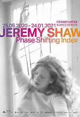

 ## Titre de l'oeuvre : index d'états de transition

 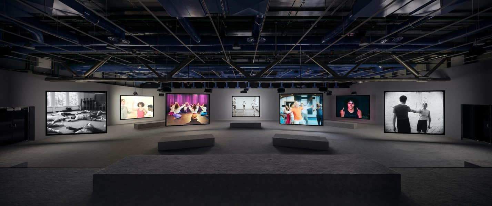

## Année de réalisation

Réalisé en 2020 

## Date de visite

 Le 31 janvier 2024 

## Lieu de mise en exposition : Fonderie Darling

 

 
 ## Type d'exposition
 
 Dans une salle moyennement grande avec quelques projecteurs et des écrans. 

 
 ## Nom de l'artiste

 L'exposition de Jeremy Shaw

 ## Se qui m'a plu et mon expérience vécue
 
 Je n’ai jamais vraiment assisté à une  exposition de ma vie, mais celle-ci m’a permis de découvrir un peu à quoi consiste une exposition, qui est un événement qui attise la curiosité du public et qui permet de montrer l’art d’une différente manière. Pour commencer, j’ai trouvé très agréable de profiter de cette exposition avec de très doux tapis. Cela permet de profiter de cette expérience confortablement, que ce soit assis où coucher. Le visiteur décide de comment il veut profiter de cette activité. Cette exposition explore la différente pratique de la transcendance à travers les projecteurs suivis d’une bande sonore qui permet de rendre cette activité immersive.

## Description de l'oeuvre

Les écrans présentaient des vidéos qui montraient une troupe qui dansait de manière un peu différente des autres troupes des autres écrans, mais avec le même objectif qui est d’entrer sous l’état de la transcendance, accompagné d’une bande sonore qui rendait l’exposition immersive. Quelques minutes plus tard, la musique devenait de plus en plus intense jusqu’a se que les différents danseurs avaient atteint leur objectif de transe. J’ai trouvé intéressant qu’ils effectuaient tous la même danse, tout le monde dans la pièce qui profitait de cette activité tout comme moi avait cessé de faire du bruit, étonné par ce changement aussi soudain. J’ai bien aimé l’effet de bogue d’ordinateur lorsque les danseurs étaient en transe, car cela nous permettait de comprendre la sensation d’être en transe.
#
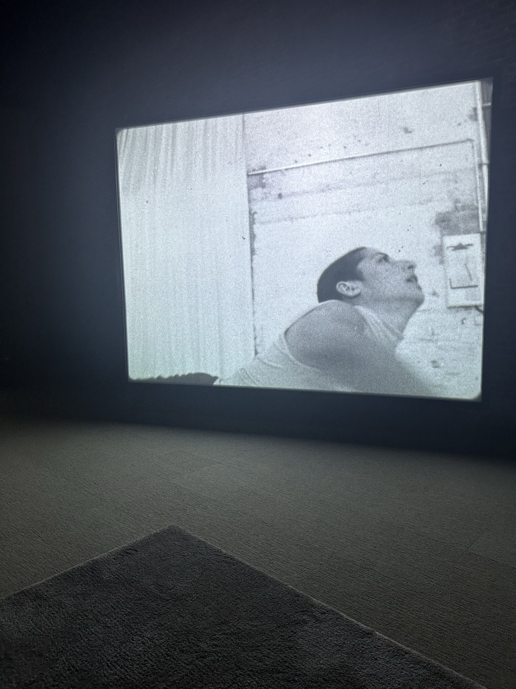
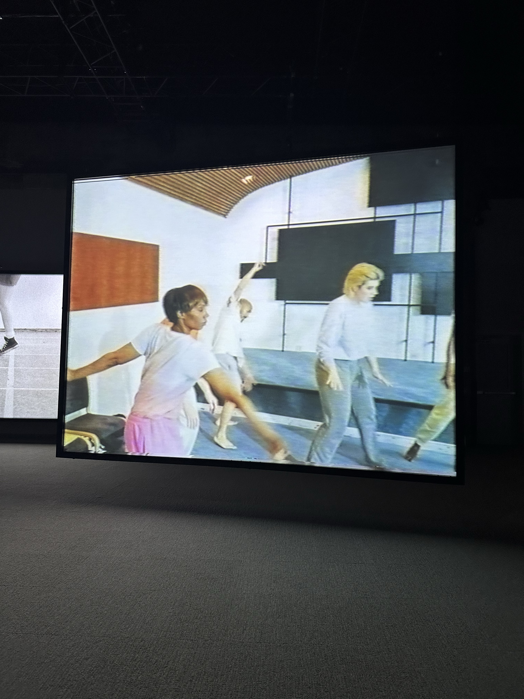

## Type d'installation: Vaste installation vidéo immersive à sept canaux

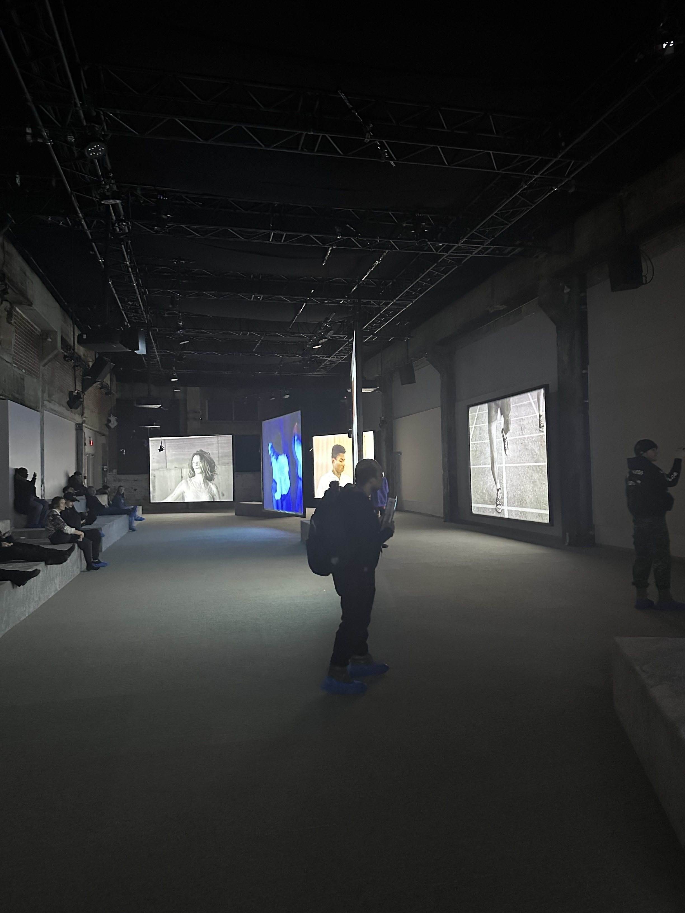

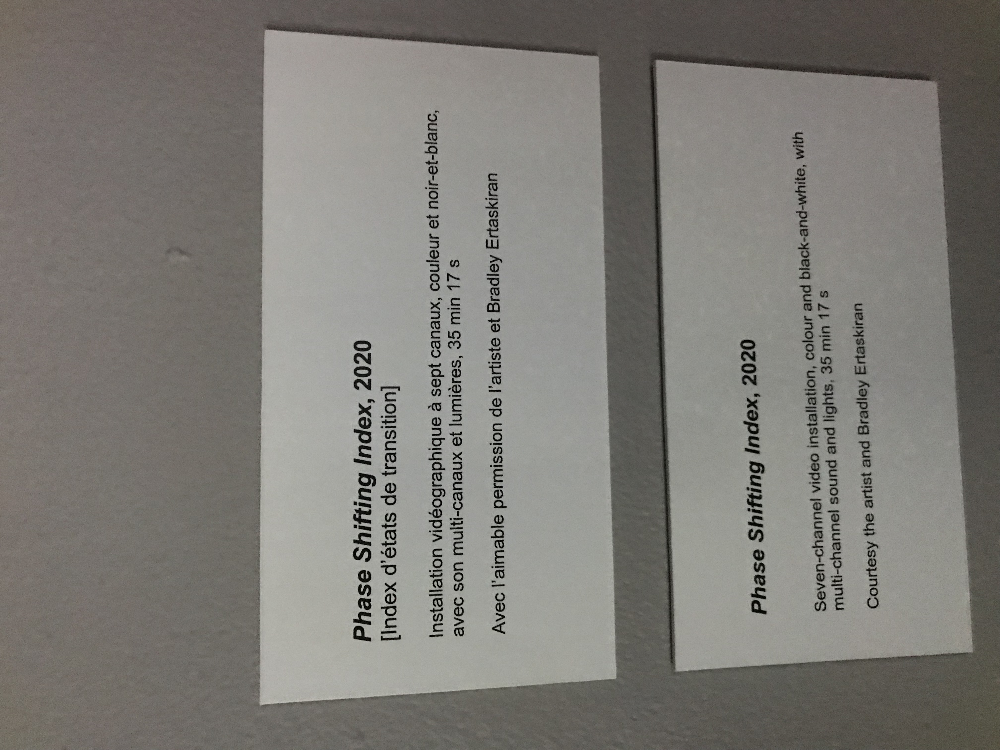

## Mise en espace

l'exposition dispose de doux tapis et des bancs qui permet de mieux profitié de cette exhibition.

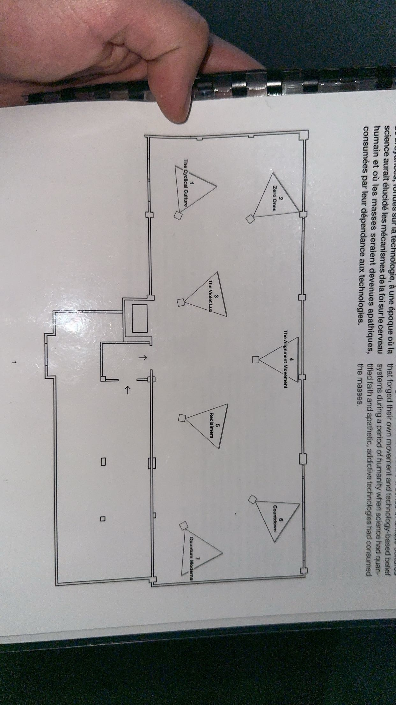

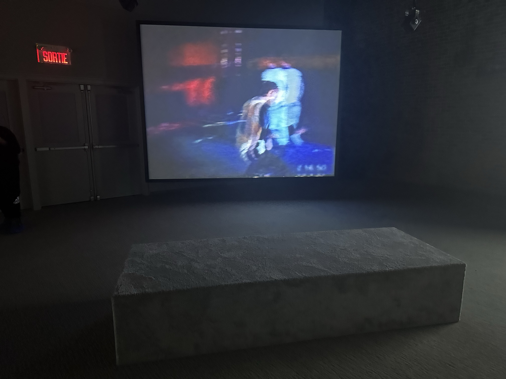

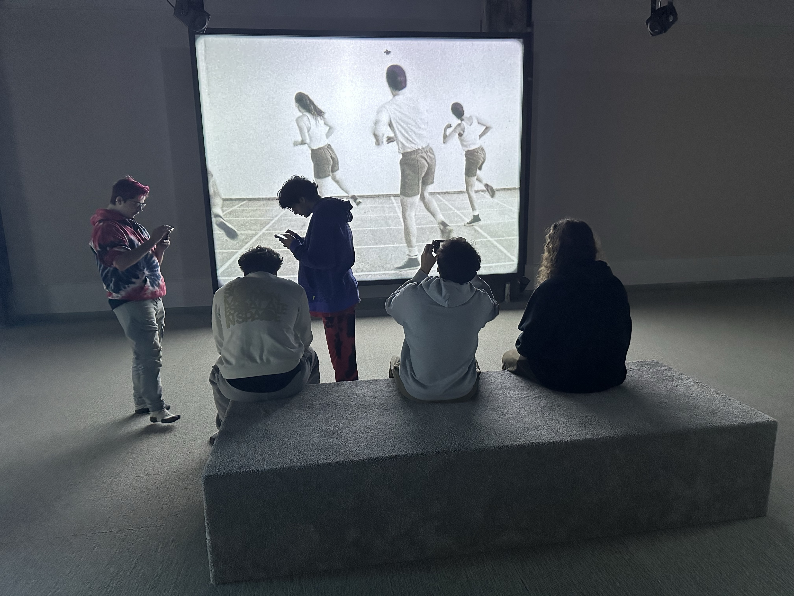

## Expérience vécu : moment de transe

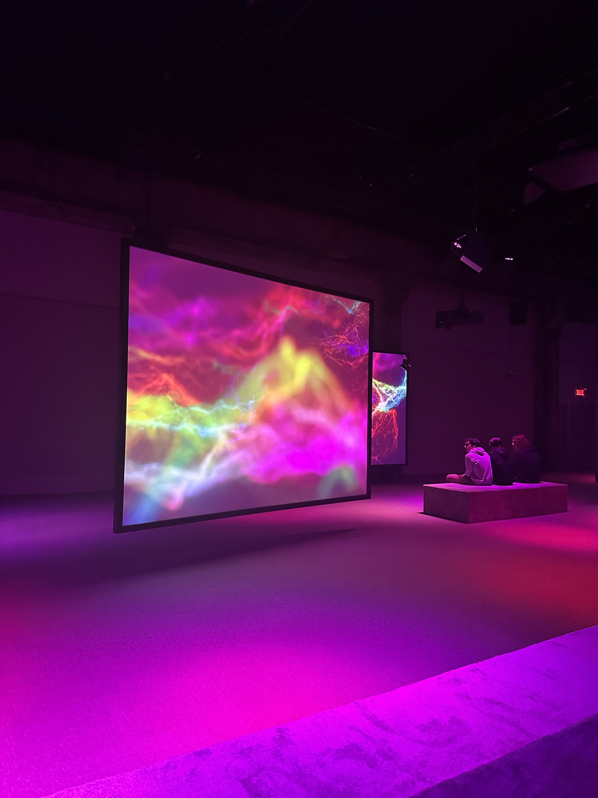

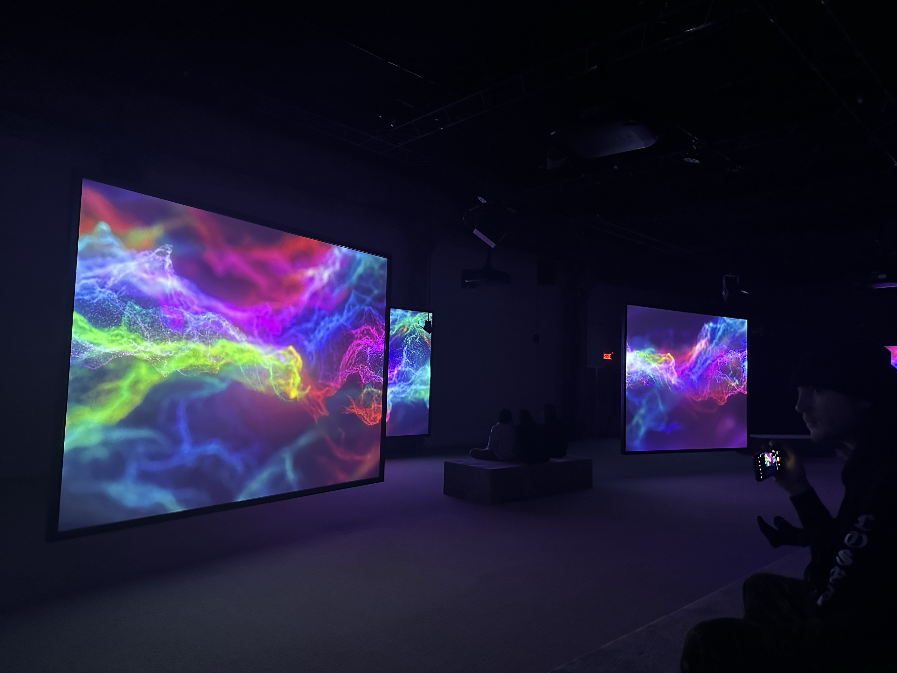

