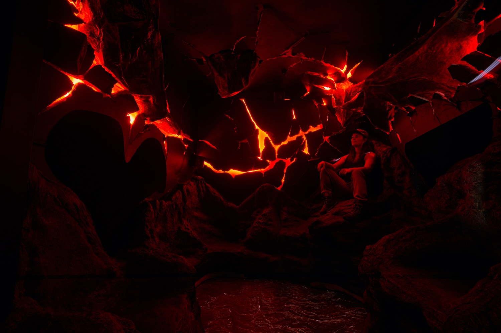
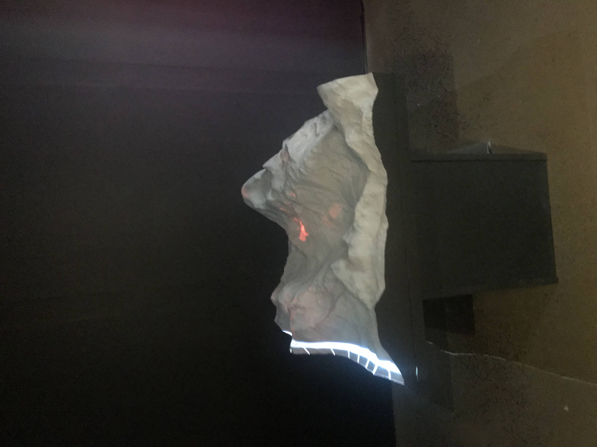
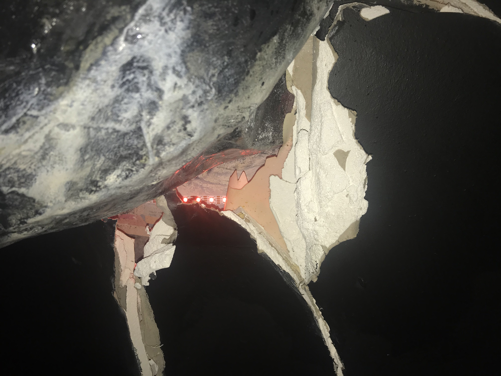
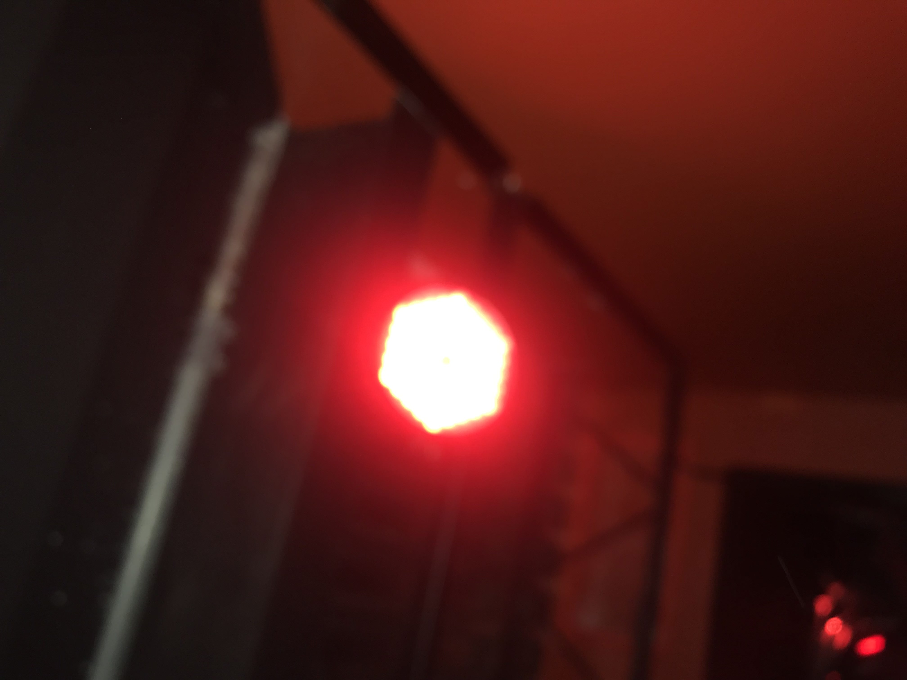
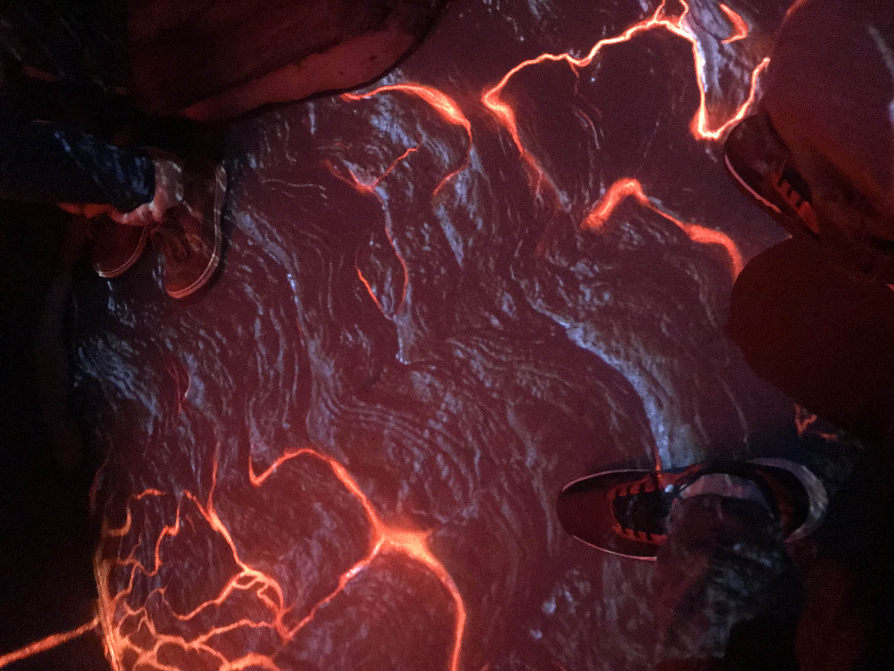
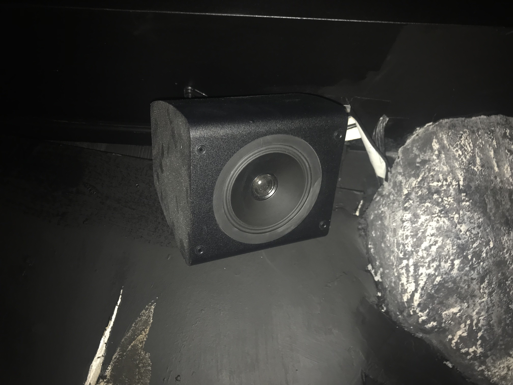
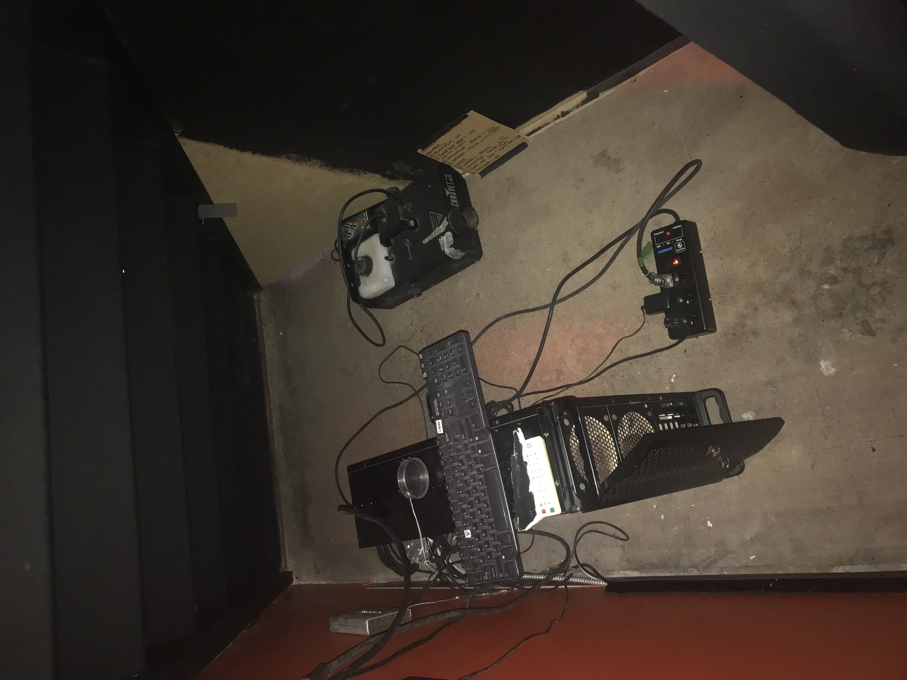
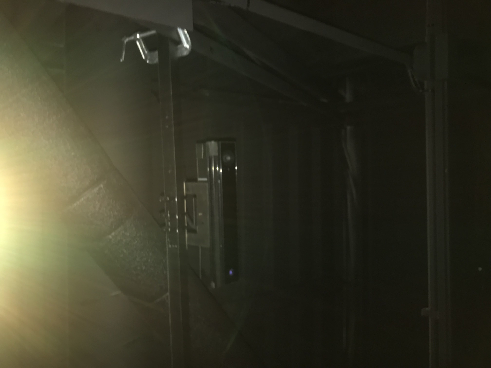
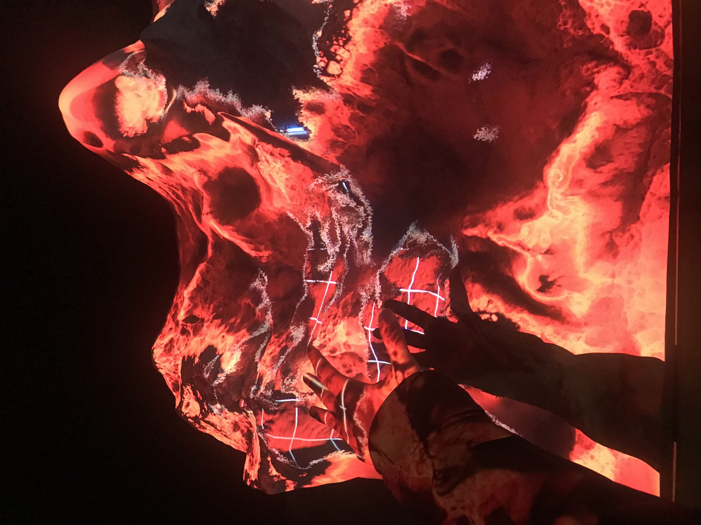
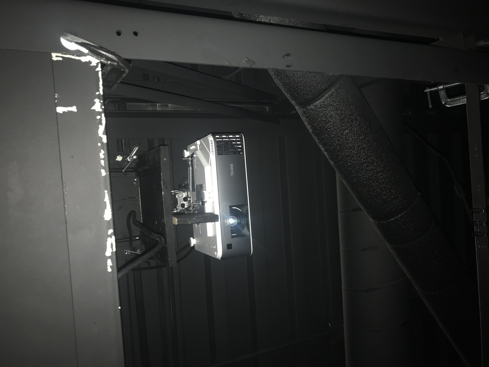

# Mon avis sur cette expérience

## Nom de l'exposition : L'exposition d'Aude Guivarc’h

## Lieu de mise en exposition : Age of Union 7049 Rue St-Urbain

## Type d'exposition
Les expositions se déroulait dans un batiment comme une sorte de galerie d'art et il était de notre libre arbitre d'assisté ax expositions que l'on voulait voir

## Date de visite : 2 mars 2024

## Titre de l'eouvre : Lava Cave et Écosystème Alpha

## Nom de l'artiste : Aude Guivarc’h 

Année de réalisation : ?

## Description de l'oeuvre: Lava Cave 

Lava Cave" est une installation immersive multisensorielle réalisée par Aude Guivarc’h, plongeant le public au cœur de la planète Terre. Invitant les visiteurs à utiliser leurs cinq sens pour contempler la profonde manifestation physique des mécanismes internes de la Terre, l’installation donne l’impression d’être au sein d'une matrice magmatique où les forces de cisaillement et la pression tectonique agissent en permanence. L’élément interactif de l’installation est conçu pour générer une expérience unique pour chaque spectateur ou groupe de spectateurs, les encourageant ainsi à réfléchir à leur relation avec le monde naturel et à l’interconnexion de chaque chose.

Source : https://ageofunion.com/fr/articles/2023/04/18/age-of-union-annonce-la-saison-printemps-ete-2023-du-centre-terre/

## Description de l'oeuvre : L'Écosystème Alpha 

ÉCOSYSTÈME ALPHA, d’Aude Guivarc’h, est une allégorie de l’état de notre planète et de l’impact des humains. Elle renvoie à l’expression « Il n’y a pas de planète B », avec un relief montagneux imprimé en 3D et des projections de cycles naturels tels que l’eau, le vent, l’érosion et les changements de saison. Toutefois, si l’on s’approche trop près et qu’on obstrue la projection (ou, pire encore, si l’on touche à sa surface), l’œuvre réagit et génère une séquence de destruction, illustrant ainsi la responsabilité humaine face à la destruction de l’environnement.

source : https://ageofunion.com/fr/articles/2022/04/22/age-of-union-lance-le-centre-terrestre-a-montreal   

## Type d'installation : Lava cave (interactif)

l'exposition Lava Cave comporte des leds rouges qui contrastait bien la couleur d'une zone magmatique et le projecteur, projetait au sol un sol magmatique très réaliste qui améliore l'expérience d'être au coeur de la planète. L'oeuvre magmatique comportait trois senseurs de pression, tout comme une mère, elle n'apprécie pas les gestes violents, mais réagit à l'intensité et la durée de la pression mise sur les capteurs et une surpise vous attend avec un effort collectif! l'oeuvre comportait des haut-parleurs qui projetait des sons d'un volcans en éruption se qui rendait l'oeuvre plus intense.
l'oeuvre comportait 4 places à l'apparence de rocher volcanique se qui améliorait l'immersion

## Type d'installation : L'Écosystème Alpha (interactif)
L'exposition interactive comportait un projecteur sur la plateforme 3D qui montrait les cycles naturels et lorsqu'on pertubait le capteur sensorielle l'oeuvre réagit et nous montre une séquence de destruction pour aisni recommencer son processus de création pour être en équilibre.

## Mise en espace : Lava cave 

source: https://guivar.ch/Lava-Cave
## Mise en espace : L'Écosystème Alpha

## Composantes et techniques : lava cave

#### Ambiance pour qu'on se sent dans une atomshère volcanique

#### Le capteur sensoirel fait en sorte que plus il y'a du monde, l'atmosphère volcanique se crystllise

![media](media/sol_brillant.jpg 

#### Bruit sonore de volcan en éruption

## Composantes et techniques : Écosystème Alpha

#### permet à l'exposition d'etre en état de destruction lorsqu'elle capte un mouvement physique

#### Diffuse l'expostion

## Expérience vécue
J'ai beaucoup apprécié mon expérience lors de cette exposition, en particulier le "Lava Cave". J'ai été fasciné par le fait que lorsque nous étions réunis, cela provoquait la cristallisation du volcan, ce qui souligne l'importance de l'union et démontre que nous sommes plus performants lorsque nous nous serrons les coudes. J'ai également trouvé intéressant l' "Écosystème Alpha", où j'ai été frappé par le fait que lorsque l'on touche à l'œuvre, elle se détruit, illustrant un chaos total. Cela met en lumière à l'humanité de détruire. Cette destruction peut découler de la haine, de la peur et de la tristesse, comme le montre cette œuvre.

